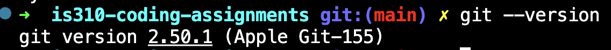
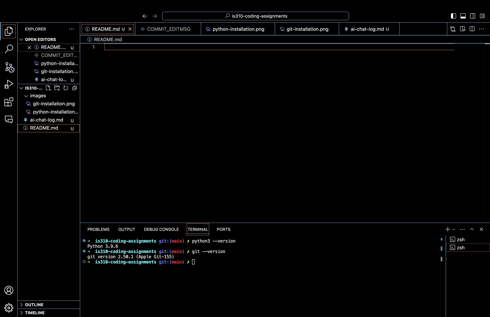

# Init IS310 Homework

## Proof of Installation

1. Python

2. Git

3. VS Code

4. Hypothesis Username

drewbowen

5. AI Tool/Workflow
Detail what AI tool, if any, do you plan to use this semester. 

I will likely utalize ChatGPT and CoPilot throughout the semester to aid in the coding process and help me troubleshoot errors.
Typically I use ChatGPT if I need something explained or to understand something better and CoPilot to help catch errors in the actual code.